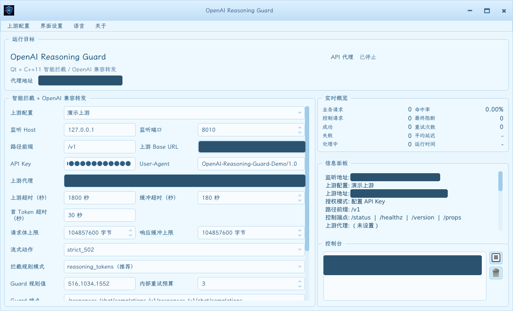

> 打个广告：模型部署优化、模型加速（云端、端侧、边缘侧）、计算机视觉相关需求欢迎联系 zhuilewang@163.com
> 面向行业与厂家：工业质检、表面缺陷检测、SOP行为检测等

# OpenAI Reasoning Guard

简体中文 | [English](README_en.md)

OpenAI Reasoning Guard 是放在 Codex / OpenAI 兼容客户端与真实上游之间的本地质量网关。它重点解决同一模型、同一请求偶发出现的“降智”、空文本、流式截断、缺少 usage 或异常结束问题：可疑响应不会直接交给客户端，而是在网关内部丢弃并重新请求，只有通过检查的结果才会返回。

## 核心功能

- **降智拦截**：检查 OpenAI usage 中的 `reasoning_tokens`，默认拦截 `516,1034,1552` 等可疑固定值。
- **完整性保护**：同时检查 JSON 与流式 SSE，识别空文本、缺 usage、缺 terminal event、`failed/error` 事件和意外断流。
- **无感内部重试**：Guard 命中、首 Token 超时及明确的上游 capacity 错误共享重试预算；中间失败不会暴露给客户端。
- **错误保真**：重试仍失败时，保留并转发最后一次真实上游错误；本地 Guard 错误使用明确状态码和 `error_type`。
- **资源与超时保护**：支持请求/响应大小上限、缓冲超时、首 Token 超时、上游总超时及客户端断开取消。
- **完整 HTTP 请求支持**：支持 `Content-Length` 和 `Transfer-Encoding: chunked`，可代理 Responses 与 Chat Completions 路径。
- **多上游管理**：用 SQLite 管理多组 Base URL、API Key、User-Agent、代理和超时，支持选择、搜索、分页及导入导出。
- **跨平台交付**：同时提供 GUI 与 CLI，发布 Linux deb/rpm/AppImage、Windows installer/portable 和 macOS shell installer。



> 截图使用独立演示配置，URL 与本机路径均已脱敏。

## 下载与快速开始

从 [GitHub Releases](https://github.com/thb1314/openai-reasoning-guard/releases) 下载与系统架构匹配的 `latest` 或 `nightly` 包。Linux 提供 deb、rpm 及 GUI/CLI AppImage；Windows 提供 installer 与 portable zip；macOS 提供 Intel 和 Apple Silicon shell installer。

安装后可直接启动 GUI：

```bash
openai-reasoning-guard-gui
```

CLI 首次使用时创建并选择一条上游配置，然后启动本地代理：

```bash
openai-reasoning-guard-cli profile add \
  --name "主线路" \
  --base-url https://api.openai.com/v1 \
  --api-key sk-example

openai-reasoning-guard-cli --proxy-host 127.0.0.1 --proxy-port 8010
```

把 Codex 或其它客户端的 OpenAI Base URL 改为 `http://127.0.0.1:8010/v1` 即可。上游配置中的 API Key 非空时固定使用该 Key；为空时透传客户端 `Authorization`，Codex 可继续使用自己的 `auth.json`。

<details>
<summary><strong>工作原理与 reasoning_tokens 说明</strong></summary>

### 请求链路

1. 客户端把 OpenAI 兼容请求发送到本地 Guard。
2. Guard 转发请求并检查 JSON 或 SSE 响应结构。
3. Responses API 读取 `usage.output_tokens_details.reasoning_tokens`；Chat Completions 读取 `usage.completion_tokens_details.reasoning_tokens`。
4. 命中 `reasoning_equals`、流式响应不完整、首 Token 超时或明确 capacity 错误时，丢弃本次上游结果并在预算内重试。
5. 通过检查的响应才返回客户端；重试耗尽后返回 Guard 错误，或按原状态码、响应头和 body 转发最后一次真实上游错误。

`reasoning_tokens` 是 OpenAI 在 `usage` 元数据中返回的推理 Token 计数，不是可见回答的字符长度，也不是本项目重新分词计算的长度。例如：

```json
{
  "usage": {
    "output_tokens": 1186,
    "output_tokens_details": {
      "reasoning_tokens": 516
    }
  }
}
```

已有观测中，`516`、`1034`、`1552` 符合 `518*n - 2`，常与异常或明显推理不足的响应同时出现，因此作为默认 Guard 集合。该规则可完全配置，也可关闭流式或非流式拦截。

严格流式模式会先缓存完整 SSE，只有确认 terminal event、usage 和内容结构正常后才整体写回。这样才能在末尾 usage 命中 Guard 时丢掉整条结果并重新请求，避免客户端收到半条答案。`stream_action=disconnect` 在仍有重试预算时同样整条丢弃；预算耗尽后才允许边转发边扫描，并在后续命中时断开。

本项目不改变模型、不修改 Prompt，也不做模型协议转换；它只在请求链路中提供可观察、可配置的响应质量门禁。

参考：

- [OpenAI Reasoning models](https://developers.openai.com/api/docs/guides/reasoning)
- [OpenAI Chat Completions API Reference](https://developers.openai.com/api/reference/resources/chat/subresources/completions/methods/create)

</details>

<details>
<summary><strong>配置文件、全局参数与上游字段</strong></summary>

### 数据文件

- `config.json`：监听地址、缓冲限制、Guard、语言和字体等全局设置。
- `upstream-profiles.sqlite3`：上游配置、API Key 和最后选中的配置 UUID。

| 平台 | 默认目录 |
| --- | --- |
| Linux | `${XDG_CONFIG_HOME:-$HOME/.config}/OpenAI Reasoning Guard/` |
| Windows | `%APPDATA%\OpenAI Reasoning Guard\` |
| macOS | `~/Library/Application Support/OpenAI Reasoning Guard/` |

可用 `--config /path/config.json` 或 `NET_TUNNEL_CONFIG=/path/config.json` 指定位置；SQLite 数据库会放在同一目录。程序原子写入配置，并在 POSIX 上把新建的配置、数据库、备份及导出文件限制为当前用户可访问。

### 全局配置示例

```json
{
  "lang": "zh",
  "ui_font_point_size": 0,
  "proxy_host": "127.0.0.1",
  "proxy_port": "8010",
  "proxy_prefix": "/v1",
  "buffer_timeout_sec": 180,
  "request_body_limit_bytes": 104857600,
  "response_buffer_limit_bytes": 104857600,
  "intercept_rule_mode": "reasoning_tokens",
  "reasoning_equals": [516, 1034, 1552],
  "guard_retry_attempts": 3,
  "retry_upstream_capacity_errors": true,
  "guard_endpoints": ["/responses", "/chat/completions", "/v1/responses", "/v1/chat/completions"],
  "intercept_streaming": true,
  "intercept_non_streaming": true,
  "non_stream_status_code": 502,
  "stream_action": "strict_502"
}
```

### 全局配置项

| 字段 | 默认值 | 示例 | 说明 |
| --- | --- | --- | --- |
| `lang` | `zh` | `"en"` | GUI 语言，只影响显示。 |
| `ui_font_point_size` | `0` | `14` | `0` 跟随系统字体；固定值范围为 `8..20 pt`。 |
| `proxy_host` | `127.0.0.1` | `"0.0.0.0"` | 本地监听地址；对外开放前应配置防火墙。 |
| `proxy_port` | `8010` | `8011` | 本地监听端口。 |
| `proxy_prefix` | `/v1` | `""` | 业务路径前缀；空值表示 root proxy，`GET /` 会转发上游。 |
| `buffer_timeout_sec` | `180` | `360` | 请求体和响应缓冲超时秒数；记录 `buffer_timeout`。 |
| `request_body_limit_bytes` | `104857600` | `10485760` | 请求体缓冲上限；超限返回 `413`。 |
| `response_buffer_limit_bytes` | `104857600` | `209715200` | 响应缓冲上限；超限返回 `502`。 |
| `intercept_rule_mode` | `reasoning_tokens` | `"final_answer_only_high_xhigh"` | Guard 判断模式；后者为 high/xhigh 实验规则。 |
| `reasoning_equals` | `[516,1034,1552]` | `[516,1034]` | 精确拦截的 reasoning Token 集合。 |
| `guard_retry_attempts` | `3` | `10` | Guard、首 Token 超时和 capacity 错误共享的内部重试预算。 |
| `reasoning_516_retry_count` | `3` | `10` | `guard_retry_attempts` 的兼容字段。 |
| `retry_upstream_capacity_errors` | `true` | `false` | 是否重试明确的上游 capacity 错误；不泛化普通 `429/502`。 |
| `guard_endpoints` | 四个 Responses/Chat 路径 | `["/v1/responses"]` | 需要检查的业务路径集合。 |
| `intercept_streaming` | `true` | `false` | 是否实际拦截流式 SSE；关闭后仍保留观察统计。 |
| `intercept_non_streaming` | `true` | `false` | 是否实际拦截非流式 JSON。 |
| `non_stream_status_code` | `502` | `503` | Guard 重试耗尽后的本地响应状态码。 |
| `stream_action` | `strict_502` | `"disconnect"` | 严格整流缓冲，或预算耗尽后的边转发边扫描模式。 |

### 上游配置字段

| 字段 | 默认值 | 示例 | 说明 |
| --- | --- | --- | --- |
| `id` | 自动 UUID | `"550e8400-..."` | 不可变标识；名称或 UUID 均可用于 CLI 定位。 |
| `display_name` | 必填 | `"主线路"` | 不区分大小写唯一，最长 `512` 个 UTF-8 字节。 |
| `base_url` | 必填 | `"https://api.openai.com/v1"` | HTTP/HTTPS Base URL；禁止凭据、query 和 fragment。 |
| `api_key` | 空 | `"sk-..."` | 非空时覆盖客户端授权；空时透传客户端 `Authorization`。 |
| `user_agent` | `curl/8.7.1` | `"codex-cli/0.1"` | 未透传客户端 UA 时发送给上游的 User-Agent。 |
| `forward_user_agent` | `false` | `true` | 是否优先转发客户端 User-Agent。 |
| `upstream_proxy` | 空 | `"http://127.0.0.1:7890"` | 单一 HTTP/SOCKS5 系代理；空值表示直连。 |
| `upstream_timeout_sec` | `1800` | `600` | 单次上游请求总超时，范围 `1..86400`；超时返回 `504`。 |
| `first_token_timeout_sec` | `30` | `10` 或 `0` | 流式首个非空 body 字节等待时间；`0` 禁用，范围 `0..3600`。 |

API Key 以明文保存在当前用户的 SQLite 数据库中，并非系统 Keychain。列表、日志、状态接口和普通导出不会显示完整 Key；只有明确使用 `--show-secret` 或 `--include-secrets` 才会输出。

旧版 JSON 上游字段会在首次启动时事务性迁移到 SQLite，并保留备份。macOS installer 会在替换旧 app 前迁移 bundle 内的 `config.json`，不会覆盖已有用户配置。

</details>

<details>
<summary><strong>CLI 上游管理与常用命令</strong></summary>

| 命令 | 示例 | 作用 |
| --- | --- | --- |
| `profile list` | `profile list --page 1 --page-size 20 --search openai` | 分页、搜索和排序配置。 |
| `profile show` | `profile show "主线路" --json` | 查看配置；增加 `--show-secret` 才显示完整 Key。 |
| `profile add` | `profile add --name "主线路" --base-url https://api.example.com/v1` | 新增配置；第一条自动成为当前配置。 |
| `profile update` | `profile update "主线路" --proxy http://127.0.0.1:7890` | 只更新明确提供的字段；`--proxy=` 表示直连。 |
| `profile delete` | `profile delete "备用线路"` | 删除未运行的配置，并自动补选下一条。 |
| `profile select` | `profile select "主线路"` | 持久化当前选择。 |
| `profile export` | `profile export --output profiles.json` | 默认不导出 Key；`--include-secrets` 显式包含。 |
| `profile import` | `profile import --input profiles.json --conflict overwrite` | 事务性导入，冲突策略为 `skip` 或 `overwrite`。 |

常用运行命令：

```bash
# 启动当前已选上游
openai-reasoning-guard-cli --proxy-host 127.0.0.1 --proxy-port 8010

# 一次性覆盖，不写入 SQLite
openai-reasoning-guard-cli \
  --upstream-base-url https://api.example.com/v1 \
  --upstream-api-key sk-example

# 查询运行状态
openai-reasoning-guard-cli --query-status \
  --query-url http://127.0.0.1:8010/status
```

`--keep-config` 只持久化监听、缓冲和 Guard 等全局参数，不保存 `--upstream-*` 临时覆盖。所有命令可用 `--config <path>`；profile 管理命令支持 `--json`。

</details>

<details>
<summary><strong>控制接口、统计口径与错误分类</strong></summary>

### 控制接口

- `GET /healthz`：健康检查和当前配置摘要。
- `GET /status` 或 `/metrics`：健康信息及运行统计。
- `GET /version` 或 `/v1/version`：版本和配置能力。
- `GET /props` 或 `/v1/props`：客户端可探测的功能开关。

空 `proxy_prefix` 下，`GET /` 会转发上游根路径，不作为健康检查。

### 主要统计

- `requests_total`：控制请求与业务请求总数。
- `control_requests_total`：控制接口请求数。
- `intercepted_requests_total`：进入代理路径的业务请求数。
- `successful_requests_total` / `failed_requests_total`：已完成业务请求的最终结果。
- `in_flight_proxy_requests`：仍在处理的业务请求；因此成功与失败之和可能暂时小于业务请求数。
- `upstream_attempts_total`：实际上游尝试次数，包含内部重试。
- `inspected_response_count` / `matched_response_count`：检查次数与 Guard 命中次数。
- `guard_match_rate`：`matched_response_count / inspected_response_count`。
- `blocked_response_count`：预算耗尽后最终阻断客户端的次数，不等同于命中次数。
- `guard_retry_total`：Guard 或受保护异常触发的重试次数。
- `buffer_timeout_total` / `first_token_timeout_total` / `upstream_timeout_total`：各类超时次数。
- `client_connection_error_total`：客户端提前断开或连接异常次数。
- `local_proxy_error_total`：本地 limit、bad request 等错误，不计入上游 HTTP 错误。
- `status_code_counts`、`observed_reasoning_counts`、`last_result`、`last_failure`：状态码、Token 分布及最近结果。

</details>

<details>
<summary><strong>源码构建、测试、打包与 GitHub Actions</strong></summary>

项目使用 C++11、Qt 5.15.x 和 CMake。Qt SDK 必须包含 Core、Network、Gui、Widgets、Sql、QtTest（测试时）以及 QSQLITE driver。

```bash
cmake -S . -B build \
  -DNET_TUNNEL_QT_SDK_ROOT=/path/to/qt5 \
  -DNET_TUNNEL_BUILD_TESTS=ON
cmake --build build -j2
ctest --test-dir build --output-on-failure
```

本机项目默认使用 `/mnt/data/qt-2080ti-sync` 下的自编译 Qt5，不自动回退到系统 Qt5。

本地打包入口：

```bash
QT_ROOT=/path/to/qt5 scripts/package-linux.sh --all --clean
QT_ROOT=/path/to/qt5 scripts/package-windows-mingw.sh --arch x86_64 --clean
QT_ROOT=/path/to/qt5 scripts/package-macos.sh --arch aarch64 --clean
```

- Linux：x86_64、x86_32、ARM64、ARM32，输出 deb、rpm、GUI/CLI AppImage。
- Windows：x86_64、x86_32、ARM64，输出 installer exe 与 portable zip。
- macOS：Intel 与 Apple Silicon，输出包含 app、CLI 和临时 DMG 载荷的 shell installer。

GitHub Actions：

- [Qt SDK Archives](.github/workflows/qt-sdk.yml)：从 Qt/OpenSSL 源码构建可复用 SDK archive。
- [OpenAI Reasoning Guard Packages](.github/workflows/linux-packages.yml)：在对应 runner 或交叉工具链上构建、测试并发布全部平台包。

最终 release 发布要求 `target=all`，会校验 24 个资产的文件名、大小和源码标签。详细架构说明见 [docs/ARCHITECTURE.md](docs/ARCHITECTURE.md)，第三方依赖见 [THIRD_PARTY_NOTICES.md](THIRD_PARTY_NOTICES.md)。

</details>

## License

项目源码采用 MIT License。仓库内 bundled 的 QUI 组件和字体资源仍按各自上游许可使用。
